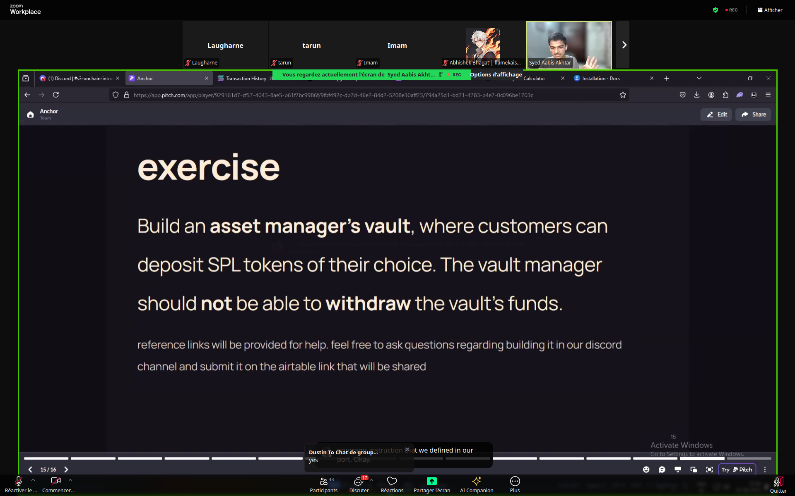

# Asset manager's vault

## Deployed program

**[Link]()**

## Overview

**Exercise:** Build an **asset manager’s vault**, where customers can deposit SPL tokens of their choice. The vault manager should not be able to withdraw the vault’s funds

Topics in this exercice :
- Rust
- Anchor
- PDA
- init_if_needed
- CPI
- ATA creation
- Token transfer

zz _node; solana-test-validator --reset
anchor test --skip-local-validator

## Resources
- Learn about CPIs: https://solana.com/docs/core/cpi (Important)
- Overview of Anchor: https://www.anchor-lang.com/docs/high-level-overview
- More about PDAs: https://solanacookbook.com/core-concepts/pdas.html#facts
- Slides: https://pitch.com/v/anchor-dudz4a
- CPI code for transferring tokens: https://github.com/solana-developers/program-examples/blob/main/tokens/transfer-tokens/anchor/programs/transfer-tokens/src/instructions/transfer.rs (Very handy)
- [Transferring SOL and building a payment splitter: &quot;msg.value&quot; in Solana](https://www.rareskills.io/post/anchor-transfer-sol)
- [Cross Program Invocation in Anchor](https://www.rareskills.io/post/cross-program-invocation)
- [PDA (Program Derived Address) vs Keypair Account in Solana](https://www.rareskills.io/post/solana-pda)
- [Solana Playground| Spl Token Vault](https://beta.solpg.io/tutorials/spl-token-vault)
